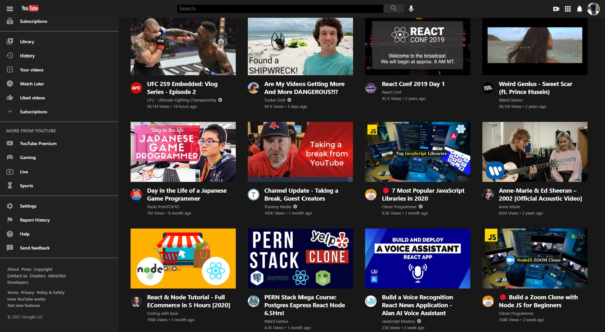
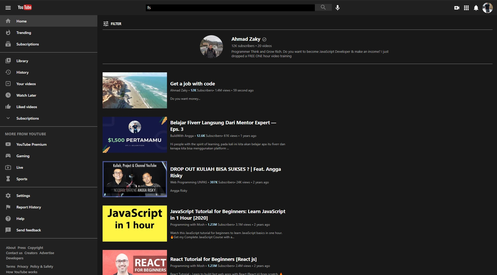

# YouTube Clone with React (dark theme)

## Screenshots





Code along tutorial teaching React, Hooks, Material UI, React Router.


## 🚀 Technologies:

- ✔ JavaScript
- ✔ React Router
- ✔ Hooks
- ✔ Material UI
- ✔ SCSS
- ✔ JSX

## Available Scripts

In the project directory, you can run:

<h4> Clone this repository </h4>

```
https://github.com/Munkiestar/YouTube-Clone-react
```

### `npm install`
### `npm start`

Runs the app in the development mode.\
Open [http://localhost:3000](http://localhost:3000) to view it in the browser.

